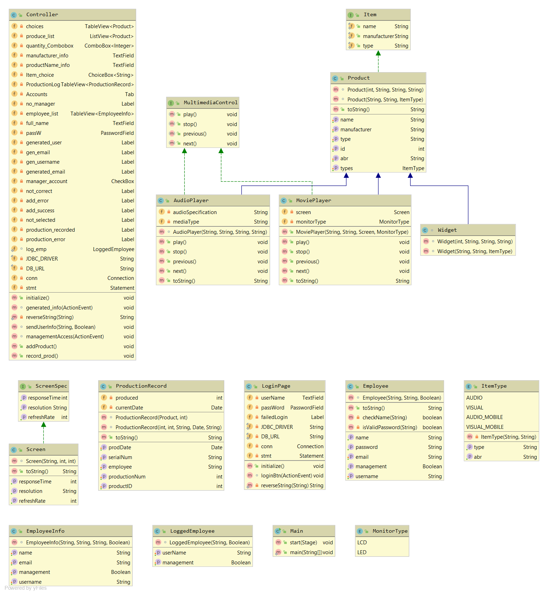
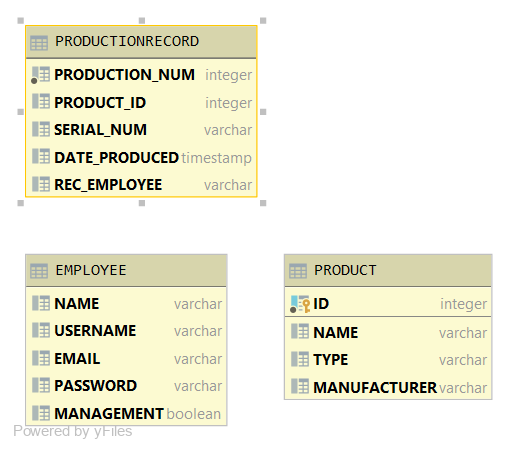

# GUI Program Project
Project created by Leemarie Collet. Made in the fall of 2019. No prior experience with Java GUI or databases. Created for project assignment in fall course COP3003 (Object Oriented Programming). 
## Demonstration

## Documentation
[docs](https://leelee1988.github.io/LineTracker/docs/html/index.html)
## Diagrams

## Getting Started

## Built With
* Intellij by JetBrains
* Java Version 8
* SceneBuilder
* H2 Database
## Contributing
Remove or modify table information. Higher level of encryption for sensitive information.Sorting and searching on tables.
## Author
* Leemarie Collet
## License
GNU General Public License - Add on completion
## Acknowledgments
* StackOverFlow
* Prof. Scott Vanselow 
## History
GUI backbone created in javaFX with scenebuilder.
## Key Programming Concepts Utilized
* Object Oriented Design
* Databases
* Recursive Functions
* Data Structures
* Data Types
* GUI Programming
* Inheritence
* Enums
* Interfaces
* Polymorphisim 
* Encapsulation
